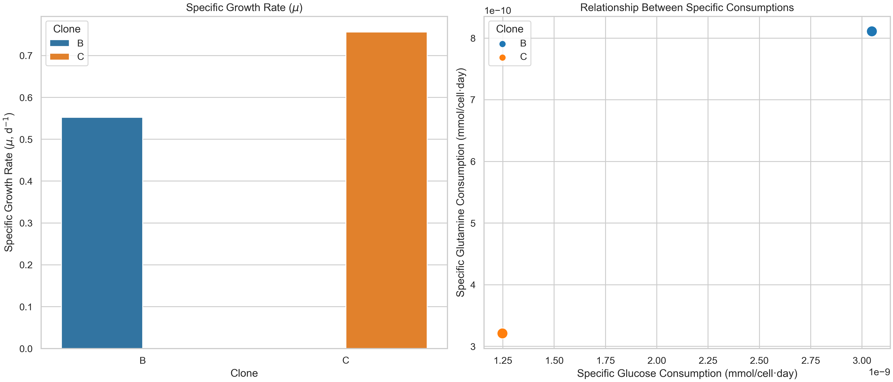

# Clonalyzer: Kinetics Data Analysis for CHO Cell Clones

## Overview
**Clonalyzer** is a Python-based tool designed to clean, process, and analyze kinetic data from CHO (Chinese Hamster Ovary) cell clones. It supports experiments involving multiple clones and replicates, enabling users to evaluate performance across various experimental conditions systematically.

### Current Features
1. **Data Cleaning**:
   - Removes inconsistencies and ensures the dataset is ready for analysis.
   - Handles missing values using user-defined strategies (e.g., mean, median, or zero filling).
   
2. **Data Preview**:
   - Provides statistical summaries (`describe`) and basic information (`info`) of the dataset to facilitate exploration.

3. **Visualization**:
   - Automatically generates key plots, such as:
     - Time vs. individual parameters (e.g., Viable Cells, Glucose, Glutamine).
     - Combined plots for parameters with similar units (e.g., Glucose and Glutamine).
   - Saves all plots in a dedicated `figures` directory.

   **Examples of Generated Visualizations**:
   - **Glucose and Glutamine vs Time**:
     
   - **Kinetic Parameter Comparison**:
     

4. **Kinetic and Stoichiometric Parameter Calculation**:
   - Calculates key parameters such as:
     - Specific growth rates (\( \mu \)).
     - Substrate uptake rates (\( q \)).
     - Biomass yields (\( Y \)).
   - Outputs results as a consolidated DataFrame for easy interpretation and visualization.

### Future Development
Planned features include:
- Advanced visualizations for kinetic and stoichiometric parameter comparisons across clones.
- Automated identification of the exponential growth phase.
- Expanded support for additional culture parameters (e.g., recombinant protein production).

This tool is ideal for researchers in biopharmaceutical development, streamlining the analysis of CHO cell cultures for clone optimization and process improvement.

---

## Authors
**Emiliano Balderas Ramírez**  
PhD Student at the Instituto de Biotecnología, UNAM  
Email: [ebalderas@live.com.mx](mailto:ebalderas@live.com.mx)  
Phone: +52 2221075693  

**Dr. Octavio Tonatiuh Ramírez Reivich**  
Principal Investigator, Instituto de Biotecnología, UNAM  
Email: [tonatiuh.ramirez@ibt.unam.mx](mailto:tonatiuh.ramirez@ibt.unam.mx)  

---

## Repository Structure
The repository is organized as follows:

```plaintext
clonalyzer/
│
├── data/                 # Contains input datasets (CSV files)
│   └── 2024-05-18_Clones_B_C_Kinetics.csv  # Example dataset
│
├── figures/              # Contains generated figures from the analysis
│   └── Glucose_and_Glutamine_vs_Time.png  # Example plot
│   └── kinetic_parameters_comparison.png # Example plot
│
├── clonalyzer.py         # Main script for data processing
├── README.md             # Documentation for the project
└── LICENSE               # License for the repository
```

---

## Requirements
To run the notebook, ensure you have Python 3.8+ and the following packages installed:

- `pandas`
- `numpy`
- `matplotlib`
- `seaborn`
- `scipy`

Install these packages using pip:
```plaintext
pip install pandas numpy matplotlib seaborn scipy
```

---

## Usage
1. **Prepare your dataset**:
   - Place your kinetic data in the `data/` folder. The dataset should be a CSV file formatted as described below.

2. **Run the notebook**:
   - Open the Jupyter Notebook `clonalyzer.ipynb` in the `script/` folder using JupyterLab or Jupyter Notebook:
     ```
     jupyter notebook script/clonalyzer.ipynb
     ```
   - Follow the cells in the notebook to preprocess, clean, and analyze the data.

3. **Outputs**:
   - The notebook generates cleaned datasets and visualizations (e.g., time-series plots, scatter plots).  

---

## Input File Requirements

### File Format
The input data must be a **CSV** file with the following specifications:

1. **File Location**:
   - Place the CSV file in the `data/` folder of the repository.
   - Update the `dataset_path` variable in the code to reference your file:
     ```python
     dataset_path = 'data/your_file_name.csv'
     ```

2. **Metadata Row**:
   - The first row in the CSV file is reserved for **metadata**. The script skips this row automatically during processing. 
   - Leave this row blank or use it for notes about the experiment.

3. **Column Names and Units**:
   - The dataset must include the following columns with the specified names and units:

| **Column Name**         | **Description**                                   | **Units**         | **Example**       |
|-------------------------|---------------------------------------------------|-------------------|-------------------|
| `Clone`                | Identifier for the CHO cell clone.               | -                 | `Clone_A`, `C1`   |
| `T`                    | Timepoints for measurements.                     | Days              | `0`, `1`, `2`     |
| `G`                    | Glucose concentration.                           | g/L               | `6.5`, `5.9`      |
| `Gln`                  | Glutamine concentration.                         | mmol/L            | `2.5`, `3.1`      |
| `Xv`                   | Viable cell density.                             | cells/mL          | `1.2e6`, `2.5e6`  |
| `Xd`                   | Dead cell density.                               | cells/mL          | `5.0e4`, `3.0e5`  |
| `L`                    | Lactate concentration.                           | g/L               | `0.5`, `1.2`      |
| `Glu`                  | Glutamate concentration.                         | mmol/L            | `1.5`, `2.0`      |
| `V`                    | Viability as a percentage.                       | %                 | `95`, `98`        |
| `MAb`                  | Monoclonal antibody concentration.               | mg/mL             | `0.8`, `1.5`      |
| `rP`                   | Recombinant protein concentration.               | mg/mL             | `0.5`, `0.9`      |
| `rep`                  | Replicate number for each clone.                 | Integer           | `1`, `2`, `3`     |

### Example Dataset
| Clone  | T   | G   | Gln | Xv      | Xd      | L   | Glu | V  | MAb | rP  | rep |
|--------|-----|-----|-----|---------|---------|-----|-----|----|-----|-----|-----|
| C1     | 0.0 | 6.5 | 2.5 | 1.2e6   | 5.0e4   | 0.5 | 1.8 | 95 | 0.8 | 0.5 | 1   |
| C1     | 1.0 | 6.2 | 2.4 | 1.8e6   | 4.5e4   | 0.6 | 2.0 | 98 | 1.0 | 0.6 | 1   |
| C2     | 0.0 | 6.4 | 2.6 | 1.1e6   | 5.2e4   | 0.5 | 1.7 | 94 | 0.7 | 0.4 | 2   |
| C2     | 1.0 | 6.1 | 2.3 | 1.7e6   | 4.7e4   | 0.6 | 1.9 | 97 | 0.9 | 0.5 | 2   |

---

## Contact
For questions or suggestions, feel free to contact:  
**Emiliano Balderas Ramírez**  
PhD Student at the Instituto de Biotecnología, UNAM  
Email: [ebalderas@live.com.mx](mailto:ebalderas@live.com.mx)  
Phone: +52 2221075693  